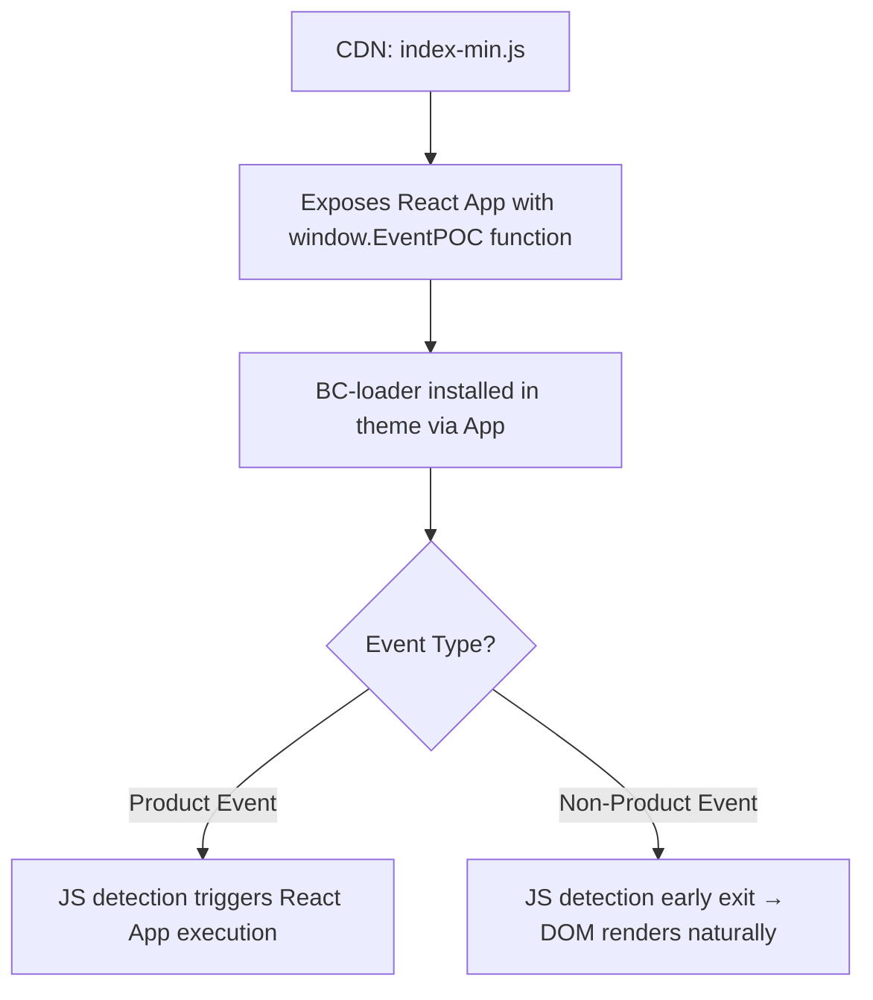

# EventPOC

This project is a proof-of-concept that demonstrates how to inject a React app into a BigCommerce Cornerstone base theme.

---

## Project Diagram

---

## Project Structure

The project contains the following files:

- **`index.js`**  
  Example React app that exposes a `window.EventPOC` object with a `loader` function accessible from the DOM.

- **`index-min.js`**  
  Minified and obfuscated version of `index.js`.  
  In a production environment, this file should be served from a CDN.

- **`bc-loader/readme.md`**  
  Documentation for the BigCommerce loader.

- **`bc-loader/bc-loader.js`**  
  Script designed to be pasted into BigCommerce Script Manager for users of EventPOC.

---

## Installation & Usage

1. **BC Loader Setup**  
   The `bc-loader.js` file is installed via the BigCommerce App installation process.

2. **Injecting the App**  
   Once configured, the loader script will inject the React app into the Cornerstone theme, exposing the `window.EventPOC.loader` function to the DOM.

---

## Notes

- Ensure that the minified app (`index-min.js`) is properly hosted on a CDN for production use.  
- The loader script allows for a seamless integration of the React app without modifying the Cornerstone theme’s core files.  
- Once we are ready for production, we need to replace the URL from the CDN in the BC-loader marked with a `// REPLACE URL HERE` flag.
